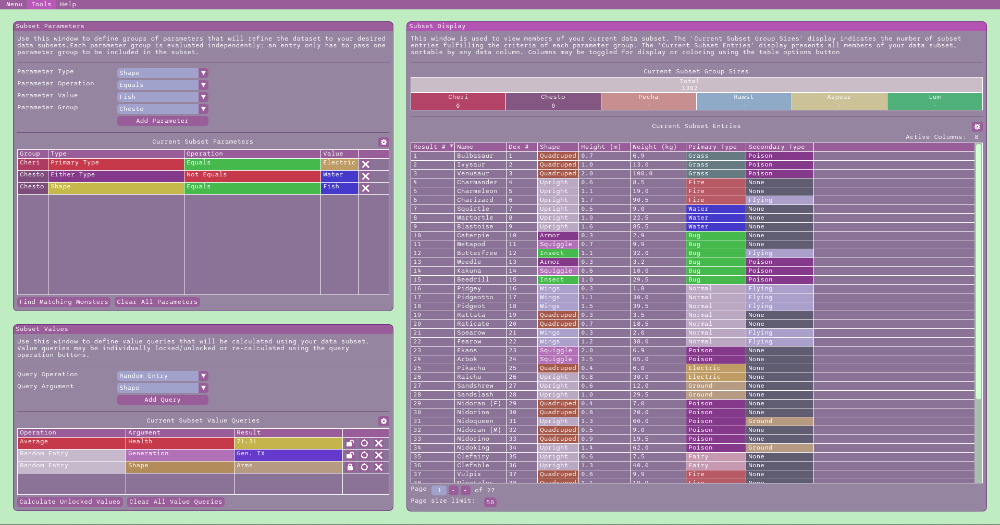

# MCC

## About

Monster Curiosity Calculator (MCC) is a database-driven statistics application developed to help answer niche questions about pocket-sized monsters. Using more data points about each monster than you likely even want, you may define parameter groups to form your desired data subset. You may then look over detailed information about data subset members and calculate values using your data subset. With MCC, you can finally answer the extremely specific questions you've always wanted to know about arbitrary groups of monsters!

MCC uses a Python script to query an existing RESTful API, gathering all needed data into an easy to parse file. That data is then processed in a C++ application to generate a SQLite database that can be interacted with using a GUI developed using the Dear ImGui library.

To download a ZIP of the program, go to MCC's itch.io page <a href="https://purpleml.itch.io/monster-curiosity-calculator" target="_blank">here</a>.

For a glimpse into aspects of MCC's development, consult my write-up <a href="https://carterboclair.com/2025/10/01/monster-calculator.html" target="_blank">here</a>.

For a video demonstration of how MCC works, check out my demonstration <a href="https://youtu.be/mzaODFaIKeg" target="_blank">here</a>.

## License

MCC is licensed under the MIT license. See <a href="https://github.com/PurpleMB/MCC/blob/main/License.txt" target="_blank">License.txt</a> for more information.

